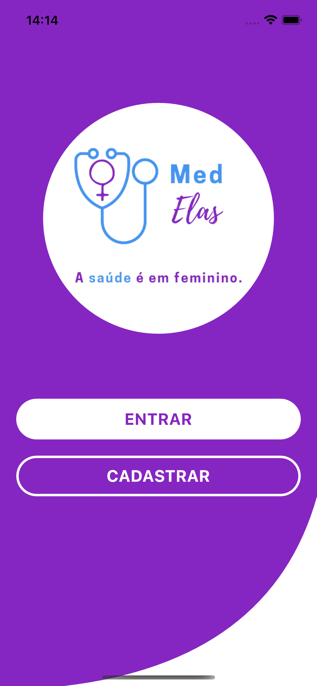
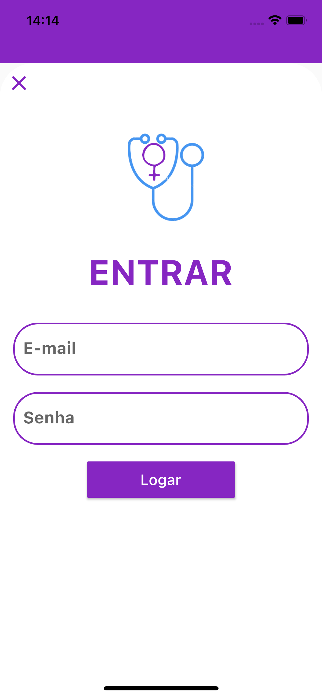
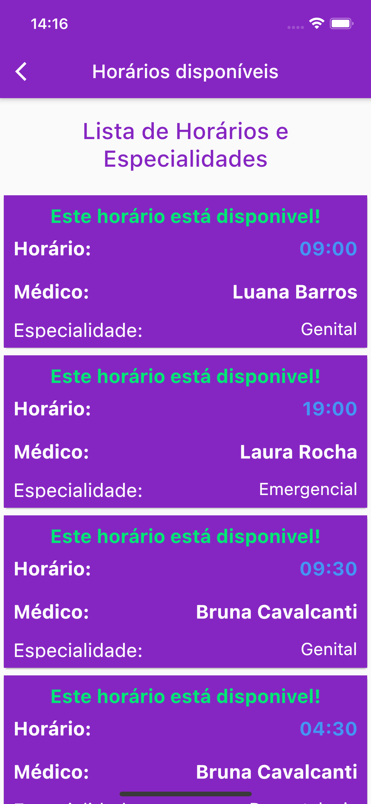
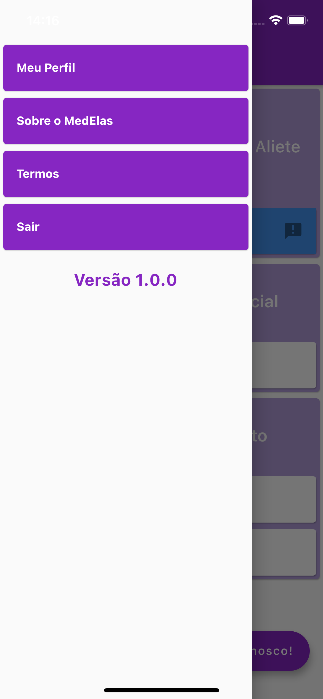

# MedElas

Olá, este repositório contém o código desenvolvido durante o evento HackatonaSp. 
Tivemos a ideia de desenvolver um aplicativo de saúde feminina, que ajudasse mulheres periféricas a ter atendimento tanto presencial quanto virtual. Infelizmente não tivemos o tempo necessário para a implementação completa, porém segue abaixo as telas iniciais desenvolvidas com a linguagem *Flutter*.

